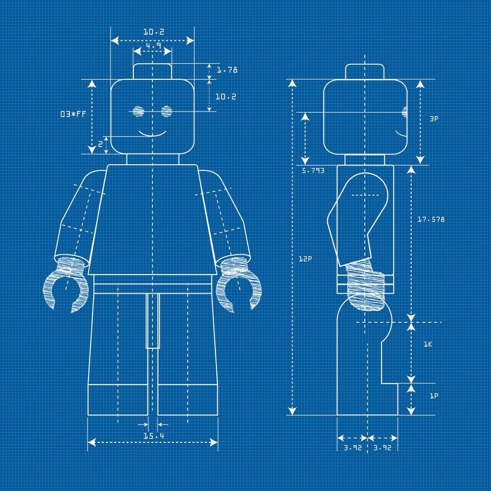
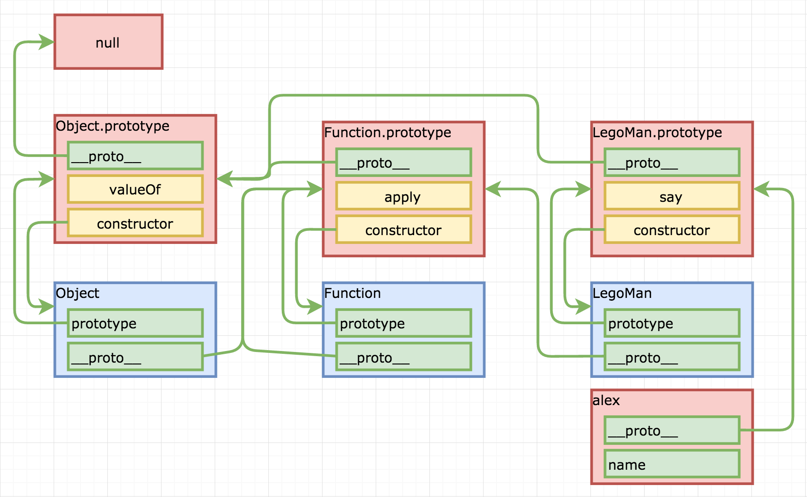
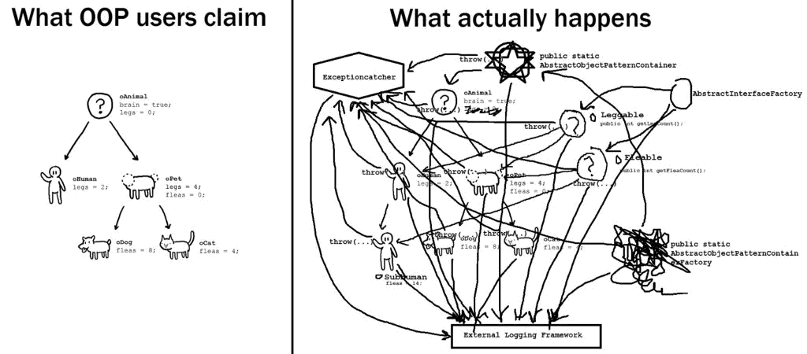

# План-конспект - 2 этап RSS

### Расписание
https://docs.google.com/spreadsheets/d/1oM2O8DtjC0HodB3j7hcIResaWBw8P18tXkOl1ymelvE/htmlview?sle=true#

### RSSchool 2019Q1
https://www.youtube.com/playlist?list=PLe--kalBDwjj81fKdWlvpLsizajSAK-lh

Airbnb JavaScript Style Guide - https://github.com/airbnb/javascript

--- 
Friday, March 29, 2019 
### NPM / Node.js basics

NPM & Node.js basics  
https://youtu.be/jX9fJwHq6VU

Типовая стуректура проекта, package.json best practices  
https://youtu.be/4psWjsQOSAQ

https://github.com/rolling-scopes-school/lectures/blob/master/lectures/rs-online-development.md


--- 
Tuesday, April 2, 2019 
### Responsive Web Design. Flexbox. CSS Grid Layout. CSS Recipes & Layouts 

https://youtu.be/k2GtDJKC6HQ


---
Wednesday, April 3, 2019 
### JS Functions		
			
RSSchool 2018Q1. JS scope + JS functions. Part1 
https://youtu.be/c_rHAYNBotQ

RSSchool 2018Q1. JS scope + JS functions. Part2 
https://youtu.be/h5o_tgEMKxY

https://github.com/rolling-scopes-school/lectures/blob/master/lectures/js-scope.md

Scopes defenition / Nested scope / Shadowing / Hoisting / No block scope / Global Scope / Global Object / Global variables are evil / ES6 let and const


---													
Wednesday, April 10, 2019 
### Inheritance in JavaScript. ES6 Classes.	

https://youtu.be/O462BetYst8   
https://github.com/rolling-scopes-school/lectures/blob/master/lectures/inheritance-in-js-and-es6-classes.md   

What is class / What is object / Classes in JS / typeof / instanceof / Inheritance / Why classes are good / Why classes are bad

<details>
<summary>конспект</summary>

##### Лексика

- *property (проперти) - свойства*
- *instance (инстанс) - объект, экземпляр класса*
- *polyfill (полифил) (англ. "polyfill") или полифилер (англ. "polyfiller") — это фрагмент кода (либо плагин), предоставляющий некоторый функционал*
  *полифил = функция, которая добавляет в старые браузеры функции, или методы объектов или классы, которых нет в этих старых браузерах.*
- *reference (референс) - ссылка*
- *lookup (локап) - поиск*
- *имплементить (от слова implementation) = реализовывать. Implementation = реализация*
- *set - установить / get - получить*
- *валидировать - проверять на соответствие параметрам*
- *scope (скоуп) - рамки, область видимости*

##### Статьи
ES6 по-человечески - https://habr.com/ru/post/305900/

##### WHAT IS CLASS?
  Class is a schema
  

##### CLASSES IN JS (BAD) FUNCTIONS
```JS
function LegoMan(name) {
    this.name = name;
    this.say = function(message) {
        console.log(this.name + ': "' + message + '"');
    }
}						

let alex = new LegoMan('Alex');
alex.say('Hello, Kattie!'); // Alex: "Hello, Kattie!"

let kattie = new LegoMan('Kattie');
kattie.say('No'); // Kattie: "No"
```

##### CLASSES IN JS (GOOD) FUNCTIONS
```JS
// создали конструктор
function LegoMan(name) {
    this.name = name; // объявили свойства
}
// методы создаем отдельно в - prototype
LegoMan.prototype.say = function(message) {
    console.log(this.name + ': "' + message + '"');
}	

let alex = new LegoMan('Alex');
alex.say('Hello, Kattie!'); // Alex: "Hello, Kattie!"
let kattie = new LegoMan('Kattie');
kattie.say('No'); // Kattie: "No"
```
##### What is prototype?
technically - a regular JS object / технически это - объект   
property of every function / есть у каждой фенкции   
created by JS environment / создается средой JS   

   
синие поля - функции (конструкторы)   
красные поля - объекты   
`__proto__` есть у каждого объекта и ссылается всегда на объект   
`prototype` есть есть только у функций и ссылается тоже на объект   

```JS
function LegoMan(name) {
    this.name = name;
}
LegoMan.prototype.say = function(message) {
    console.log(this.name + ': "' + message + '"');
}
var alex = new LegoMan('Alex');
```
Оператор `new` создает объект и проперть `__proto__` которая ссылыется (которую он замапит) на `prototype` конструктора.

##### CLASSES IN JS ES2015 CLASSES
*constructor - начальная инициализайия объекта, в большенстве случаев стартовые значения - это просто свойства*
```JS
class LegoMan {
    constructor(name) {
        this.name = name;
    }
    say(message) {
        console.log(this.name + ': "' + message + '"');
    }
}
const alex = new LegoMan('Alex');
alex.say('Hello, Kattie!'); // Alex: "Hello, Kattie!"
const kattie = new LegoMan('Kattie');
kattie.say('Hello!'); // Kattie: "Hello!"
```

##### get / set
```JS
class LegoMan {
    constructor(name) {
        this.name = name;
        this.age = 0;
    }
    set newAge(value) { // set - установить
    // можно валидировать значение
        this.age = value;
    }
    get represent() { // get - получить
        return `My name is ${this.name}. I am ${this.age} years old.`;
    }
}
const alex = new LegoMan('Alex');
alex.represent // My name is Alex. I am 0 years old.
alex.newAge = 18;
alex.represent // My name is Alex. I am 18 years old.
```

##### Статические методы
Статические методы живут в контексте класса
```JS 
class LegoMan {
    constructor(name) {
        this.name = name;
    }
    static getInfo(man) {
        return `This is ${man.name}.`;
    }
}
const alex = new LegoMan('Alex');
LegoMan.getInfo(alex); // This is Alex
alex.getInfo // undefined
```

##### TYPEOF
```JS
typeof 132 // "number"
typeof 2.71 // "number"
typeof 'Alex' // "string"
typeof LegoMan // "function"
typeof true // "boolean"
typeof {} // "object""
typeof NaN // "number"
typeof new Number(132) // "object"
typeof [1, 2, 3] // "object", Array.isArray should be used
Array.isArray([1,2,3]) // true
typeof null // "object"
```

##### INSTANCEOF
Оператор instanceof проверяет, принадлежит ли объект к определённому классу.
``` JS
class LegoMan {
    constructor(name) {
        this.name = name;
    }
}
const alex = new LegoMan('Alex');
alex instanceof LegoMan // true
alex instanceof Object // true
```

##### INHERITANCE - наследование в js
В классическом ООП - класс наследуется от класса
В JS прототипное наследование - объект наследуется от объекта прототипа 
```JS
function Foo(y) {
  this.y = y;
}
Foo.prototype.x = 10; 
Foo.prototype.calculate = function (z) {
  return this.x + this.y + z;
}; 
let b = new Foo(20);
let c = new Foo(30);
b.calculate(30); // 60
c.calculate(40); // 80
 
console.log( 
  b.__proto__ === Foo.prototype, // true
  c.__proto__ === Foo.prototype, // true  
    b.constructor === Foo, // true
    c.constructor === Foo, // true
    Foo.prototype.constructor === Foo, // true 
      b.calculate === b.__proto__.calculate, // true
      b.__proto__.calculate === Foo.prototype.calculate // true 
);
```
 

##### INHERITANCE ES2015 WAY
*extends - наследовать, продолжить, расширить*
https://youtu.be/O462BetYst8?t=5394    
https://www.youtube.com/watch?v=ehSGhaDHehI    

```JS
class LegoBatMan extends LegoMan {
    constructor(name) {
        super(name);
    }
    say(message) { // переопределение метода say
        console.log('|\\__/|');
        super.say(message);
        console.log('|\\__/|');
    }
}
const bruce = new LegoBatMan('Bruce');
bruce.say('this city needs a hero');
// |\__/|
// Bruce: "this city needs a hero"
// |\__/|
```	
Если сделать насделование без конструктора, то будет использован конструктор родителя.
```JS
class LegoBatMan extends LegoMan {} 
```	
Ключевое слово `super()` - ссылается на конструктор родительского класса



</details>

---
Monday, April 15, 2019 
### css-methodologies, BEM	Web Typography	

https://github.com/rolling-scopes-school/lectures/blob/master/lectures/css-methodologies.md

https://habr.com/ru/post/256109/


---
Friday, April 19, 2019 
### DOM																
https://youtu.be/TewWd-6ZrmE 

https://github.com/rolling-scopes-school/lectures/blob/master/lectures/dom.md

Content: What is DOM? / Node props & methods / Element props & methods / ClassList API / HTMLElement props & methods
document 


---
Wednesday, April 24, 2019 
### DOM Events

https://youtu.be/G6_YTv78Q1g
https://youtu.be/vcXehC9JgGU

https://github.com/rolling-scopes-school/lectures/blob/master/lectures/dom-events.md

Content: Triggers / Event Types / Mouse Events / Keyboard / Events / Drag Events / Focus Events / Touch Events / Event Handling Models / inline / traditional / W3C / Event Object props and methods / Event capturing and bubbling / Event delegation


---
Friday, April 26, 2019	
### Event Loop. Animation										
https://youtu.be/dG5ZaHYdre8

https://github.com/rolling-scopes-school/lectures/blob/master/lectures/event-loop-and-animations.md

Content: 
Event Loop : Call stack / Event Loop / Callback queue / Web APIs 
Animations : CSS3 Transitions / CSS3 Transforms / requestAnimationFrame / Performance issues / Practical task


---
Thursday, May 2, 2019
### Bootstrap												
https://youtu.be/1Nk09Z4ca4A?list=PLe--kalBDwjj81fKdWlvpLsizajSAK-lh


---
Friday, May 3, 2019	
### Modules in JS

https://youtu.be/7e-5P6iPFzY

https://github.com/rolling-scopes-school/lectures/blob/master/lectures/js-modules.md

### ES6 features. ESLint. Airbnb JavaScript Style Guide

https://youtu.be/SqC3MQZ2Ndg?list=PLe--kalBDwjhdXudsOpKooP6q9bAl3rPG

https://youtu.be/tus1W_1Tx8U?list=PLe--kalBDwjhni4LpATaJscPwZUudxVHS


---
Monday, May 6, 2019		
### Самообучение Webpack. Assets management. Project Structure.											
https://youtu.be/ssORHjHHCzU

https://github.com/rolling-scopes-school/lectures/blob/master/lectures/webpack.md


---
Wednesday, May 8, 2019		
### Самообучение HTTP / HTTP2 / AJAX / Promises								
https://youtu.be/x3ByCM78ETw
https://youtu.be/iTi1bXSJre0 

https://github.com/rolling-scopes-school/lectures/blob/master/lectures/http.md


--- 
Saturday, May 11, 2019	
### JS Callbacks & Promises & async/await
https://www.youtube.com/watch?v=0fFg3c4C9tA 2018
https://youtu.be/OyQToid6w8E 2017

https://github.com/rolling-scopes-school/lectures/blob/master/lectures/promises-game-dev.md


---
Tuesday, May 21, 2019	
### CSS Preprocessors. SASS CSS frameworks

https://youtu.be/uKLecRul8g4 2017
https://youtu.be/3en2mA2MJec?list=PLe--kalBDwjj81fKdWlvpLsizajSAK-lh 2019 

https://github.com/rolling-scopes-school/lectures/blob/master/lectures/css-preprocessors.md


---
### Lodash
https://youtu.be/RIp8cF5yTY0														