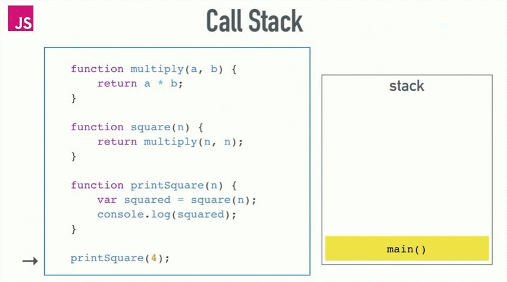
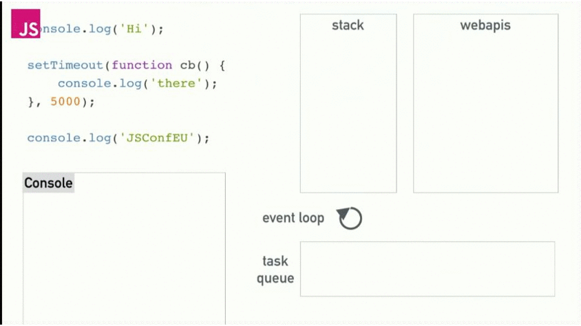
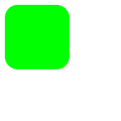

# Курс JavaScript (JS) лекции - 2 этап (rolling scopes school)

- Расписание: https://docs.google.com/spreadsheets/d/1oM2O8DtjC0HodB3j7hcIResaWBw8P18tXkOl1ymelvE/htmlview?sle=true#
- RSSchool 2019Q1: https://www.youtube.com/playlist?list=PLe--kalBDwjj81fKdWlvpLsizajSAK-lh

## Course Content
1. [NPM / Node.js basics](#npm--nodejs-basics)
1. [Responsive Web Design. Flexbox. CSS Grid Layout. CSS Recipes & Layouts](#responsive-web-design-flexbox-css-grid-layout-css-recipes--layouts)
1. [JS Functions](#js-functions)
1. [Inheritance in JavaScript. ES6 Classes.](#inheritance-in-javascript-es6-classes)
1. [css-methodologies, BEM	Web Typography](#css-methodologies-bemweb-typography)
1. [DOM](#dom)
1. [DOM Events](#dom-events)
1. [Event Loop. Animation](#event-loop-animation)
1. [Bootstrap](#bootstrap)
1. [Modules in JS](#modules-in-js)
1. [ES6 features. ESLint. Airbnb JavaScript Style Guide](#es6-features-eslint-airbnb-javascript-style-guide)
1. [Webpack. Assets management. Project Structure](#webpack-assets-management-project-structure)
1. [HTTP / HTTP2 / AJAX / Promises](#http--http2--ajax--promises)
1. [JS Callbacks & Promises & async/await](#js-callbacks--promises--asyncawait)
1. [CSS Preprocessors. SASS CSS frameworks](#css-preprocessors-sass-css-frameworks)
1. [Lodash](#lodash)
1. [Interview corejs](#interview-corejs)


--- 
## NPM / Node.js basics
▲ [Course Content](#course-content) | Friday, March 29, 2019 

- https://github.com/rolling-scopes-school/lectures/blob/master/lectures/rs-online-development.md

NPM & Node.js basics  
https://youtu.be/jX9fJwHq6VU

Типовая стуректура проекта, package.json best practices  
https://youtu.be/4psWjsQOSAQ


--- 
## Responsive Web Design. Flexbox. CSS Grid Layout. CSS Recipes & Layouts 
▲ [Course Content](#course-content) | Tuesday, April 2, 2019 

- https://github.com/rolling-scopes-school/lectures/blob/master/lectures/css-recipies-and-layouts.md
- https://youtu.be/k2GtDJKC6HQ


---
## JS Functions	
▲ [Course Content](#course-content) | Wednesday, April 3, 2019 
			
- https://github.com/rolling-scopes-school/lectures/blob/master/lectures/js-scope.md            
- RSSchool 2018Q1. JS scope + JS functions. Part1 - https://youtu.be/c_rHAYNBotQ
- RSSchool 2018Q1. JS scope + JS functions. Part2 - https://youtu.be/h5o_tgEMKxY


---										
## Inheritance in JavaScript. ES6 Classes.  
▲ [Course Content](#course-content) | Wednesday, April 10, 2019    
- https://github.com/rolling-scopes-school/lectures/blob/master/lectures/inheritance-in-js-and-es6-classes.md 
- https://youtu.be/O462BetYst8   

### Content:   
- What is class
- What is object
    - key
    - value
- Classes in JS
    - Object literals
    - Functions
    - ES2015 classes
- typeof
- instanceof
- Inheritance
    - classical
    - prototypal
- Inheritance
    - Crockford way
    - ES5 way
    - ES2015 way
- Why classes are good
- Why classes are bad

<details>
<summary>конспект</summary>


### Лексика
- *property (проперти) - свойства*
- *instance (инстанс) - объект, экземпляр класса*
- *polyfill (полифил) (англ. "polyfill") или полифилер (англ. "polyfiller") — это фрагмент кода (либо плагин), предоставляющий некоторый функционал*
  *полифил = функция, которая добавляет в старые браузеры функции, или методы объектов или классы, которых нет в этих старых браузерах.*
- *reference (референс) - ссылка*
- *lookup (локап) - поиск*
- *имплементить (от слова implementation) = реализовывать. Implementation = реализация*
- *set - установить / get - получить*
- *валидировать - проверять на соответствие параметрам*
- *scope (скоуп) - рамки, область видимости*

### Статьи
ES6 по-человечески - https://habr.com/ru/post/305900/

### WHAT IS CLASS?
  Class is a schema
  

### CLASSES IN JS (BAD) FUNCTIONS
```JS
function LegoMan(name) {
    this.name = name;
    this.say = function(message) {
        console.log(this.name + ': "' + message + '"');
    }
}						

let alex = new LegoMan('Alex');
alex.say('Hello, Kattie!'); // Alex: "Hello, Kattie!"

let kattie = new LegoMan('Kattie');
kattie.say('No'); // Kattie: "No"
```

### CLASSES IN JS (GOOD) FUNCTIONS
```JS
// создали конструктор
function LegoMan(name) {
    this.name = name; // объявили свойства
}
// методы создаем отдельно в - prototype
LegoMan.prototype.say = function(message) {
    console.log(this.name + ': "' + message + '"');
}	

let alex = new LegoMan('Alex');
alex.say('Hello, Kattie!'); // Alex: "Hello, Kattie!"
let kattie = new LegoMan('Kattie');
kattie.say('No'); // Kattie: "No"
```
### What is prototype?
technically - a regular JS object / технически это - объект   
property of every function / есть у каждой фенкции   
created by JS environment / создается средой JS   

   
синие поля - функции (конструкторы)   
красные поля - объекты   
`__proto__` есть у каждого объекта и ссылается всегда на объект   
`prototype` есть есть только у функций и ссылается тоже на объект   

```JS
function LegoMan(name) {
    this.name = name;
}
LegoMan.prototype.say = function(message) {
    console.log(this.name + ': "' + message + '"');
}
var alex = new LegoMan('Alex');
```
Оператор `new` создает объект и проперть `__proto__` которая ссылыется (которую он замапит) на `prototype` конструктора.

### CLASSES IN JS ES2015 CLASSES
*constructor - начальная инициализайия объекта, в большенстве случаев стартовые значения - это просто свойства*
```JS
class LegoMan {
    constructor(name) {
        this.name = name;
    }
    say(message) {
        console.log(this.name + ': "' + message + '"');
    }
}
const alex = new LegoMan('Alex');
alex.say('Hello, Kattie!'); // Alex: "Hello, Kattie!"
const kattie = new LegoMan('Kattie');
kattie.say('Hello!'); // Kattie: "Hello!"
```

### get / set
```JS
class LegoMan {
    constructor(name) {
        this.name = name;
        this.age = 0;
    }
    set newAge(value) { // set - установить
    // можно валидировать значение
        this.age = value;
    }
    get represent() { // get - получить
        return `My name is ${this.name}. I am ${this.age} years old.`;
    }
}
const alex = new LegoMan('Alex');
alex.represent // My name is Alex. I am 0 years old.
alex.newAge = 18;
alex.represent // My name is Alex. I am 18 years old.
```

### Статические методы
Статические методы живут в контексте класса
```JS 
class LegoMan {
    constructor(name) {
        this.name = name;
    }
    static getInfo(man) {
        return `This is ${man.name}.`;
    }
}
const alex = new LegoMan('Alex');
LegoMan.getInfo(alex); // This is Alex
alex.getInfo // undefined
```

### TYPEOF
```JS
typeof 132 // "number"
typeof 2.71 // "number"
typeof 'Alex' // "string"
typeof LegoMan // "function"
typeof true // "boolean"
typeof {} // "object""
typeof NaN // "number"
typeof new Number(132) // "object"
typeof [1, 2, 3] // "object", Array.isArray should be used
Array.isArray([1,2,3]) // true
typeof null // "object"
```

### INSTANCEOF
Оператор instanceof проверяет, принадлежит ли объект к определённому классу.
``` JS
class LegoMan {
    constructor(name) {
        this.name = name;
    }
}
const alex = new LegoMan('Alex');
alex instanceof LegoMan // true
alex instanceof Object // true
```

### INHERITANCE - наследование в js   
В классическом ООП - класс наследуется от класса   
В JS прототипное наследование - объект наследуется от объекта прототипа    
```JS
function Foo(y) {
  this.y = y;
}
Foo.prototype.x = 10; 
Foo.prototype.calculate = function (z) {
  return this.x + this.y + z;
}; 
let b = new Foo(20);
let c = new Foo(30);
b.calculate(30); // 60
c.calculate(40); // 80
 
console.log( 
  b.__proto__ === Foo.prototype, // true
  c.__proto__ === Foo.prototype, // true  
    b.constructor === Foo, // true
    c.constructor === Foo, // true
    Foo.prototype.constructor === Foo, // true 
      b.calculate === b.__proto__.calculate, // true
      b.__proto__.calculate === Foo.prototype.calculate // true 
);
```
 

### INHERITANCE ES2015 WAY
*extends - наследовать, продолжить, расширить*
https://youtu.be/O462BetYst8?t=5394    
https://www.youtube.com/watch?v=ehSGhaDHehI    

```JS
class LegoBatMan extends LegoMan {
    constructor(name) {
        super(name);
    }
    say(message) { // переопределение метода say
        console.log('|\\__/|');
        super.say(message);
        console.log('|\\__/|');
    }
}
const bruce = new LegoBatMan('Bruce');
bruce.say('this city needs a hero');
// |\__/|
// Bruce: "this city needs a hero"
// |\__/|
```	
Если сделать насделование без конструктора, то будет использован конструктор родителя.
```JS
class LegoBatMan extends LegoMan {} 
```	
Ключевое слово `super()` - ссылается на конструктор родительского класса


</details>


---
## css-methodologies, BEM	Web Typography	
▲ [Course Content](#course-content) | Monday, April 15, 2019 
- https://github.com/rolling-scopes-school/lectures/blob/master/lectures/css-methodologies.md
- https://habr.com/ru/post/256109/


---
## DOM
▲ [Course Content](#course-content) | Friday, April 19, 2019 			
- https://github.com/rolling-scopes-school/lectures/blob/master/lectures/dom.md								
- https://youtu.be/TewWd-6ZrmE 
- Slides - http://rolling-scopes.github.io/slides/school/dom/#/

#### Content:
* What is DOM?
* `Node` props & methods
* `Element` props & methods
* `ClassList` API
* `HTMLElement` props & methods
* `document`

#### Useful links
- [Custom Elements](http://www.html5rocks.com/en/tutorials/webcomponents/customelements/)
- [Shadow DOM 101](http://www.html5rocks.com/en/tutorials/webcomponents/shadowdom/)

--- 
## DOM Events
▲ [Course Content](#course-content) | Wednesday, April 24, 2019
- https://github.com/rolling-scopes-school/lectures/blob/master/lectures/dom-events.md  
- https://youtu.be/G6_YTv78Q1g   
- https://youtu.be/vcXehC9JgGU   
 

### Content
* Triggers
* Event Types
  * Mouse Events
  * Keyboard Events
  * Drag Events
  * Focus Events
  * Touch Events
* Event Handling Models
  * inline
  * traditional
  * W3C
* Event Object props and methods
* Event capturing and bubbling
* Event delegation


---
## Event Loop. Animation	
▲ [Course Content](#course-content) | Friday, April 26, 2019										
- https://youtu.be/dG5ZaHYdre8   
- https://github.com/rolling-scopes-school/lectures/blob/master/lectures/event-loop-and-animations.md

### Content
* Event Loop
  * Call stack
  * Event Loop
  * Callback queue
  * Web APIs
* Animations
  * CSS3 Transitions
  * CSS3 Transforms
  * requestAnimationFrame
  * Performance issues
  * Practical task

<details>
<summary>конспект</summary>

### Лексика:
- *Event Loop - цикл событий*
- *Callback - функция обраатного вызова*
- *Call stack - стек вызовов*
- *Callback queue или task queue, или event queue - очередь обратных вызовов или очередь задач, или очередь событий* 
- *Web API - Интерфейс прикладного программирования (Application Programming Interfaces, APIs)*

JS is single-threaded | JS является однопоточным   
one thread = one callstack = one thing at a time | один поток = один стек вызовов = одна вещь за раз  

<table>
<tr><th>Code</th><th>Callstack (Стек вызовов)</th></tr>
<tr><td>

```JS
function mul(a, b) {
	return a * b;
}
function square(a) {
	return mul(a, a);
}
function printSquare() {
	console.log(square(42));
}
printSquare();  
``` 
</td>
<td>

1. +push printSquare
2. +push square
3. +push mul
4. -pop mul
5. -pop square
6. -pop printSquare
</td></tr>  
<tr><td>

```JS
function asyncJob() {
  setTimeout(fucntion job() {
    console.log("I'm done");
  }, 5000);
}
asyncJob(); 
``` 
</td>
<td>

1. +push asyncJob
1. +push setTimeout
1. +push job to callback queue
1. -pop setTimeout
1. -pop asyncJob
1. =now WebAPI waits 5000ms
1. +push job
1. +pop job
</td></tr>    
</table>

 

### Event Loop (цикл событий)
Event Loop - calls functions from callback queue when stack is empty   
Цикл событий - вызывает функции из очереди обратного вызова (задач, событий), когда стек пуст   
Главная задача `Event Loop` следить за `Call stack` и `Callback (Task, Event) queue`, как только Call stack пуст - передать в него задачу из Callback queue.

<table>
<tr><th>Code</th><th>Callstack</th></tr>
<tr><td>

```JS
console.log('hello');

setTimeout(function () {
   console.log('!')
}, 0);

console.log('world');
```
</td>
<td>

1. hello
1. world
1. !
</td></tr>
<tr><td>

```JS
var start = Date.now();
var c;

console.log("start = " + new Date());

setTimeout(function () {
    console.log("timeout = " + new Date());
}, 1000);

while (start + 2000 > Date.now()) {
    var c = 3 + 3 + 3;
}

console.log("end = " + new Date());
```
</td>
<td>

1. start = Tue Jun 18 2019 09:09:53 GMT+0300 (Москва, стандартное время)
1. end = Tue Jun 18 2019 09:09:55 GMT+0300 (Москва, стандартное время)
1. timeout = Tue Jun 18 2019 09:09:55 GMT+0300 (Москва, стандартное время)
</td></tr>
<tr><td>

Пример G-кода 
```JS
for (var i = 1; i <= 2; i++) {
    console.log('цикл');
    setTimeout(function() { console.log('i =', i) }, 100);
}
```
</td>
<td>

1. цикл
1. цикл
1. i = 3
1. i = 3
</td></tr>
<tr><td>

```JS
for (let i = 1; i <= 2; i++) {  
    console.log('цикл');  
    setTimeout(function() { console.log('i =', i) }, 100);
}
```
```JS
for (var i = 1; i <= 2; i++) {
    (function () {
        console.log('цикл');
        var local = i;
        setTimeout(function() { console.log('i =', local) }, 100);
    })();
}
```

</td>
<td>

1. цикл
1. цикл
1. i = 1
1. i = 2
</td></tr>

</table>

 

* видео:   
Про `цикл событий` в JavaScript или "как на самом деле работает асинхронность"? - https://www.youtube.com/watch?v=8cV4ZvHXQL4   
* ссылки:  
web_APIs - https://developer.mozilla.org/ru/docs/Learn/JavaScript/Client-side_web_APIs/Introduction   
setTimeout - https://developer.mozilla.org/ru/docs/Web/API/WindowTimers/setTimeout   
loupe - http://latentflip.com/loupe   
https://github.com/Exictos-DCS/watch-your-language/blob/master/async.md   

### Animations 
CSS transitions:   
https://learn.javascript.ru/css-transitions#css-transition   

CSS animations:   
https://learn.javascript.ru/css-transitions#css-animations   
https://developer.mozilla.org/en-US/docs/Web/CSS/CSS_Animations/Using_CSS_animations   
https://html5book.ru/css3-animation/   

transform:   
https://www.w3schools.com/css/css3_3dtransforms.asp
https://html5book.ru/css3-transform/   

### Анимация JS
`Window.getComputedStyle()` - https://developer.mozilla.org/en-US/docs/Web/API/Window/getComputedStyle   
Метод Window.getComputedStyle() возвращает объект содержащий значения всех CSS свойств элемента, полученные после применения всех активных таблиц стилей и завершения базовых вычислений значений, которые они могут содержать.   
`Element.getBoundingClientRect()` - https://developer.mozilla.org/en-US/docs/Web/API/Element/getBoundingClientRect   
Метод `Element.getBoundingClientRect()` возвращает размер элемента и его позицию относительно viewport (точки   просмотра или ширины экрана в пикселях CSS в масштабе 100%.)   
`.setInterval()` - https://developer.mozilla.org/en-US/docs/Web/API/WindowOrWorkerGlobalScope/setInterval   
`.setTimeout()` - https://developer.mozilla.org/en-US/docs/Web/API/WindowOrWorkerGlobalScope/setTimeout

### Examples
HTML:   
```html
<!DOCTYPE html>
<html lang="en">

<head>
    <meta charset="UTF-8">
    <meta name="viewport" content="width=device-width, initial-scale=1.0">
    <meta http-equiv="X-UA-Compatible" content="ie=edge">
    <title>Document</title>
    <link rel="stylesheet" href="test.css">
</head>

<body>
    <div class="shape" id="shape"></div>
    <script src="test.js"></script>
</body>

</html>
```
CSS:   
Первоначально shape - синий прямоугольник   
```CSS
.shape {
  background-color: blue;
  width: 100px;
  height: 200px;
}
```
JS:   
```JS
function shapeChange() {
    const COLOR_RED = 'rgb(255, 0, 0)';
    const COLOR_GREEN = 'rgb(0, 255, 0)';

    let shape = document.querySelector("#shape");
    let compStyles = window.getComputedStyle(shape);
    let boundingClientRect = shape.getBoundingClientRect();

    console.log('shape :', shape); // элемент
    console.log('compStyles', compStyles); // выводим все стили элемента
    console.log('boundingClientRect :', boundingClientRect); // размеры и положение элемента

    setInterval(animation, 1500); // задаем интервал анимации    
    function animation() {
        let backgroundColor = compStyles.getPropertyValue('background-color');

        if (backgroundColor == COLOR_RED) {
            shape.style.backgroundColor = COLOR_GREEN;
            shape.style.height = '100px';
            shape.style.width = '100px';
            shape.style.borderRadius = '20%';
        } else if (backgroundColor == COLOR_GREEN) {
            shape.style.backgroundColor = COLOR_RED;
            shape.style.height = '150px';
            shape.style.width = '150px';
            shape.style.borderRadius = '100%';
        } else {
            shape.style.backgroundColor = COLOR_GREEN;
        }
    }
}
shapeChange();
```



</details>


---
## Bootstrap
▲ [Course Content](#course-content) | Thursday, May 2, 2019												
- https://youtu.be/1Nk09Z4ca4A?list=PLe--kalBDwjj81fKdWlvpLsizajSAK-lh   
- YouTube client task - https://github.com/rolling-scopes-school/tasks/blob/2018-Q3/tasks/youtube.md


---
## Modules in JS
▲ [Course Content](#course-content) | Friday, May 3, 2019	
- https://github.com/rolling-scopes-school/lectures/blob/master/lectures/js-modules.md
- https://youtu.be/7e-5P6iPFzY
- http://kirilknysh.github.io/js-modules-talk/#/

### Content:
1. CommonJS modules
    - Node.js and require
    - NPM and package.json
    - Bower and bower.json
2. Modules in JavaScript
    - ECMAScript 5 module systems
    - ECMAScript 6 modules
3. The basics of ES6 modules
    - Named exports
    - Default exports
    - Cyclic dependencies
4. Import and Export in details
    - Babel
    - System.js

### Further reading
- http://exploringjs.com/es6/ch_modules.html
- http://jsmodules.io/cjs.html


---
## ES6 features. ESLint. Airbnb JavaScript Style Guide
▲ [Course Content](#course-content) | Friday, May 3, 2019	
- https://github.com/rolling-scopes-school/lectures/blob/master/lectures/es6.md
- 2018 Airbnb - https://youtu.be/SqC3MQZ2Ndg?list=PLe--kalBDwjhdXudsOpKooP6q9bAl3rPG   
- 2017 - https://youtu.be/tus1W_1Tx8U?list=PLe--kalBDwjhni4LpATaJscPwZUudxVHS   

### Airbnb: 
- https://github.com/airbnb/javascript

### ESLint & Styleguides
- http://slides.com/uladzimirhalushka/deck-2-3
- http://slides.com/uladzimirhalushka/deck-2

### Useful links
- http://www.smashingmagazine.com/2015/09/eslint-the-next-generation-javascript-linter/


---	
## Webpack. Assets management. Project Structure.
▲ [Course Content](#course-content) | Monday, May 6, 2019	
- https://github.com/rolling-scopes-school/lectures/blob/master/lectures/webpack.md
- https://youtu.be/ssORHjHHCzU   
- Slides - https://docs.google.com/presentation/d/1NTxLzTdci-wvVq0GYAMA7BQYPQKnHEBYt0bOZN-SEMo/mobilepresent?slide=id.g29603f67f0_0_50


### Content:
- history
- modules vs flat files (gulp vs webpack)
- modules & dependences
- code splitting
- Webpack vs AMD, CommonJS, ES6, Browserify
- performance
- config:
    - entry
    - output
    - plugins
    - loaders
    - preLoaders
- devtool
- tips & tricks
- limitations
- webpack power in real life
  

---		
## HTTP / HTTP2 / AJAX / Promises
▲ [Course Content](#course-content) | Wednesday, May 8, 2019	
- https://github.com/rolling-scopes-school/lectures/blob/master/lectures/http.md  							
- https://youtu.be/x3ByCM78ETw   
- https://youtu.be/iTi1bXSJre0     

### Content:
- History and basic structure of WWW
  - CERN, Sir Timothy John «Tim» Berners-Lee, Håkon Wium Lie
  - Client-Server model
  - DNS
  - TCP-IP; Vinton Gray “Vint” Cerf
  - Model OSI
  
- Structure of HTTP protocol
  - Methods
  - Parameters
  - Cookies
  - Headers
  - Status codes

- HTTP features
  - Simple
  - Stateless
  - Pull protocol
  - Scaleable+ a little bit about load balancers
  - Idempotency

- Web Services
  - XML-RPC
  - SOAP
  - REST

- Security
  - Session
  - HTTPS

- Conclusion
  - Tips & Tricks
  - Useful programs & commands 
  - What to read


--- 
## JS Callbacks & Promises & async/await
▲ [Course Content](#course-content) | Saturday, May 11, 2019	
- https://github.com/rolling-scopes-school/lectures/blob/master/lectures/promises-game-dev.md  
- https://www.youtube.com/watch?v=0fFg3c4C9tA - Game dev. JS Callbacks _ Promises (2018)   
- https://youtu.be/OyQToid6w8E - RS School 2017Q3. Promises, Animations, GameDev (2017)   
 

### Slides:
- http://andrei-yanovich.github.io/ajax-talk/#/
- http://andrei-yanovich.github.io/promise-talk/#/
- https://docs.google.com/presentation/d/1jZ-ucWUsklFmbOrMwZNHagR_ABy0zHSv-RSC2KY6kIk/edit#slide=id.p

### Content:
* Ajax
   * WTF is ajax (sync vs async web app model)
   * History
   * XHR api (content types, status, readyState, onreadystatechange, props, methods)
   * JQuery ajax
   * Same origin policy
   * JSONP
   * CORS
   * COMET, WS
   * pros/cons
* Promise:
   * JQuery deferreds API
   * Examples
   * Promise
   * Promise states
   * Promise API
   * Example with ajax


---
## CSS Preprocessors. SASS CSS frameworks
▲ [Course Content](#course-content) | Tuesday, May 21, 2019	
- https://github.com/rolling-scopes-school/lectures/blob/master/lectures/css-preprocessors.md 
- https://youtu.be/uKLecRul8g4 2017   
- https://youtu.be/3en2mA2MJec?list=PLe--kalBDwjj81fKdWlvpLsizajSAK-lh 2019    


---
## Lodash
▲ [Course Content](#course-content)
https://youtu.be/RIp8cF5yTY0

---
## Interview corejs
▲ [Course Content](#course-content)
### Question examples:
   * Data types in JS. Type coercion.
   * What is hoisting?
   * Let vs var. Const.
   * Passing data by value and by reference. Exapmles.
   * `{a: 10} == {a: 10}`. What will the code return?
   * What is `this`?
   * Apply, call, bind. What are they used for? What are the differences?
   * Closure. Give an example.
   * Sum(1)(2);
   * Prototype. Differences between `__proto__` and `prototype`. Example of inheritance.
   * How to create an object without a prototype?
   * Array methods that loop over the elements.
   * `“hello world”.repeating(3)` -> `hello world hello world hello world`. How to implement?
   * Browser events. Browser default actions abortion.
   * Event bubbling and event capturing.
   * Event delegation. Example.
   * Write a function `F` so `new F === F`
   * `Function.prototype.bind` polyfill.
   * `Object.create` polyfill.
   * Event loop.
   * Promises.

Full name and contacts of the mentor who will interview you can be found in this 

### Passing the interview
1. You should contact the mentor personally. Contact details will be announced through Discord.
2. At the request of the mentor, the interview can take place online or face-to-face.
3. During the interview mentor:
  - asks questions;
  - gets answers;
  - adds/corrects/explains/gives the right answer, if necessary.

The interview should be passed before 16 June 2019. Take into account that mentor can be busy (vacation, business trip, workload and etc.), so contact him as soon as possible.

- Ссыка на таск: https://github.com/rolling-scopes-school/tasks/blob/2018-Q3/tasks/interview-corejs.md
- Контакты ментора: http://app.rs.school/mentor-contacts?course=rs-2019-q1