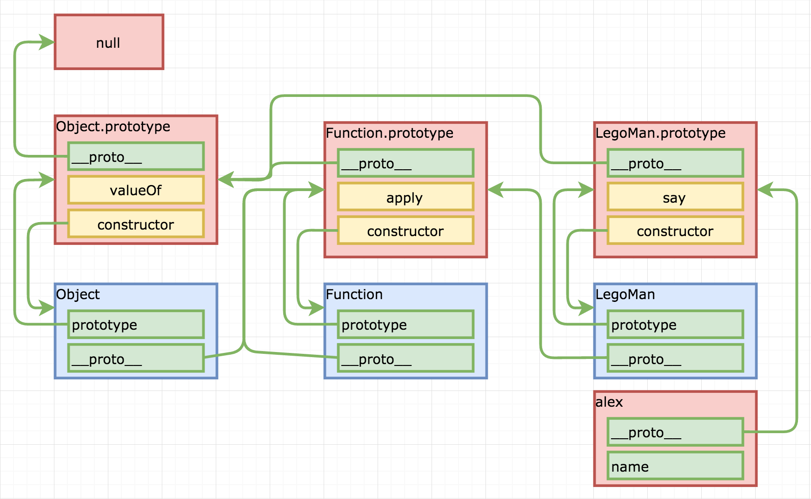
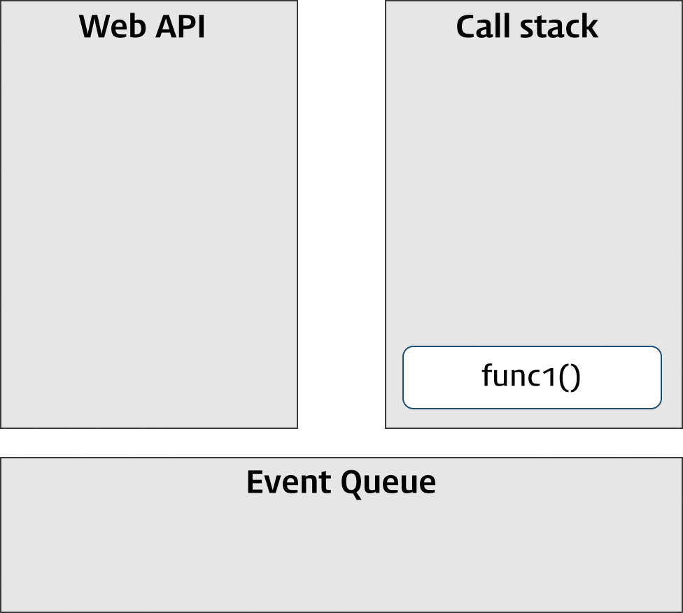

# Курс JavaScript (JS) лекции - 2 этап (rolling scopes school)

## Расписание
https://docs.google.com/spreadsheets/d/1oM2O8DtjC0HodB3j7hcIResaWBw8P18tXkOl1ymelvE/htmlview?sle=true#

## RSSchool 2019Q1
https://www.youtube.com/playlist?list=PLe--kalBDwjj81fKdWlvpLsizajSAK-lh

Airbnb JavaScript Style Guide - https://github.com/airbnb/javascript

--- 
Friday, March 29, 2019 
## NPM / Node.js basics

NPM & Node.js basics  
https://youtu.be/jX9fJwHq6VU

Типовая стуректура проекта, package.json best practices  
https://youtu.be/4psWjsQOSAQ

https://github.com/rolling-scopes-school/lectures/blob/master/lectures/rs-online-development.md


--- 
Tuesday, April 2, 2019 
## Responsive Web Design. Flexbox. CSS Grid Layout. CSS Recipes & Layouts 

https://youtu.be/k2GtDJKC6HQ


---
Wednesday, April 3, 2019 
## JS Functions		
			
RSSchool 2018Q1. JS scope + JS functions. Part1 
https://youtu.be/c_rHAYNBotQ

RSSchool 2018Q1. JS scope + JS functions. Part2 
https://youtu.be/h5o_tgEMKxY

https://github.com/rolling-scopes-school/lectures/blob/master/lectures/js-scope.md

Scopes defenition / Nested scope / Shadowing / Hoisting / No block scope / Global Scope / Global Object / Global variables are evil / ES6 let and const


---													
Wednesday, April 10, 2019 
## Inheritance in JavaScript. ES6 Classes.	

https://youtu.be/O462BetYst8   
https://github.com/rolling-scopes-school/lectures/blob/master/lectures/inheritance-in-js-and-es6-classes.md   

What is class / What is object / Classes in JS / typeof / instanceof / Inheritance / Why classes are good / Why classes are bad

<details>
<summary>конспект</summary>


### Лексика
- *property (проперти) - свойства*
- *instance (инстанс) - объект, экземпляр класса*
- *polyfill (полифил) (англ. "polyfill") или полифилер (англ. "polyfiller") — это фрагмент кода (либо плагин), предоставляющий некоторый функционал*
  *полифил = функция, которая добавляет в старые браузеры функции, или методы объектов или классы, которых нет в этих старых браузерах.*
- *reference (референс) - ссылка*
- *lookup (локап) - поиск*
- *имплементить (от слова implementation) = реализовывать. Implementation = реализация*
- *set - установить / get - получить*
- *валидировать - проверять на соответствие параметрам*
- *scope (скоуп) - рамки, область видимости*

### Статьи
ES6 по-человечески - https://habr.com/ru/post/305900/

### WHAT IS CLASS?
  Class is a schema
  

### CLASSES IN JS (BAD) FUNCTIONS
```JS
function LegoMan(name) {
    this.name = name;
    this.say = function(message) {
        console.log(this.name + ': "' + message + '"');
    }
}						

let alex = new LegoMan('Alex');
alex.say('Hello, Kattie!'); // Alex: "Hello, Kattie!"

let kattie = new LegoMan('Kattie');
kattie.say('No'); // Kattie: "No"
```

### CLASSES IN JS (GOOD) FUNCTIONS
```JS
// создали конструктор
function LegoMan(name) {
    this.name = name; // объявили свойства
}
// методы создаем отдельно в - prototype
LegoMan.prototype.say = function(message) {
    console.log(this.name + ': "' + message + '"');
}	

let alex = new LegoMan('Alex');
alex.say('Hello, Kattie!'); // Alex: "Hello, Kattie!"
let kattie = new LegoMan('Kattie');
kattie.say('No'); // Kattie: "No"
```
### What is prototype?
technically - a regular JS object / технически это - объект   
property of every function / есть у каждой фенкции   
created by JS environment / создается средой JS   

   
синие поля - функции (конструкторы)   
красные поля - объекты   
`__proto__` есть у каждого объекта и ссылается всегда на объект   
`prototype` есть есть только у функций и ссылается тоже на объект   

```JS
function LegoMan(name) {
    this.name = name;
}
LegoMan.prototype.say = function(message) {
    console.log(this.name + ': "' + message + '"');
}
var alex = new LegoMan('Alex');
```
Оператор `new` создает объект и проперть `__proto__` которая ссылыется (которую он замапит) на `prototype` конструктора.

### CLASSES IN JS ES2015 CLASSES
*constructor - начальная инициализайия объекта, в большенстве случаев стартовые значения - это просто свойства*
```JS
class LegoMan {
    constructor(name) {
        this.name = name;
    }
    say(message) {
        console.log(this.name + ': "' + message + '"');
    }
}
const alex = new LegoMan('Alex');
alex.say('Hello, Kattie!'); // Alex: "Hello, Kattie!"
const kattie = new LegoMan('Kattie');
kattie.say('Hello!'); // Kattie: "Hello!"
```

### get / set
```JS
class LegoMan {
    constructor(name) {
        this.name = name;
        this.age = 0;
    }
    set newAge(value) { // set - установить
    // можно валидировать значение
        this.age = value;
    }
    get represent() { // get - получить
        return `My name is ${this.name}. I am ${this.age} years old.`;
    }
}
const alex = new LegoMan('Alex');
alex.represent // My name is Alex. I am 0 years old.
alex.newAge = 18;
alex.represent // My name is Alex. I am 18 years old.
```

### Статические методы
Статические методы живут в контексте класса
```JS 
class LegoMan {
    constructor(name) {
        this.name = name;
    }
    static getInfo(man) {
        return `This is ${man.name}.`;
    }
}
const alex = new LegoMan('Alex');
LegoMan.getInfo(alex); // This is Alex
alex.getInfo // undefined
```

### TYPEOF
```JS
typeof 132 // "number"
typeof 2.71 // "number"
typeof 'Alex' // "string"
typeof LegoMan // "function"
typeof true // "boolean"
typeof {} // "object""
typeof NaN // "number"
typeof new Number(132) // "object"
typeof [1, 2, 3] // "object", Array.isArray should be used
Array.isArray([1,2,3]) // true
typeof null // "object"
```

### INSTANCEOF
Оператор instanceof проверяет, принадлежит ли объект к определённому классу.
``` JS
class LegoMan {
    constructor(name) {
        this.name = name;
    }
}
const alex = new LegoMan('Alex');
alex instanceof LegoMan // true
alex instanceof Object // true
```

### INHERITANCE - наследование в js   
В классическом ООП - класс наследуется от класса   
В JS прототипное наследование - объект наследуется от объекта прототипа    
```JS
function Foo(y) {
  this.y = y;
}
Foo.prototype.x = 10; 
Foo.prototype.calculate = function (z) {
  return this.x + this.y + z;
}; 
let b = new Foo(20);
let c = new Foo(30);
b.calculate(30); // 60
c.calculate(40); // 80
 
console.log( 
  b.__proto__ === Foo.prototype, // true
  c.__proto__ === Foo.prototype, // true  
    b.constructor === Foo, // true
    c.constructor === Foo, // true
    Foo.prototype.constructor === Foo, // true 
      b.calculate === b.__proto__.calculate, // true
      b.__proto__.calculate === Foo.prototype.calculate // true 
);
```
 

### INHERITANCE ES2015 WAY
*extends - наследовать, продолжить, расширить*
https://youtu.be/O462BetYst8?t=5394    
https://www.youtube.com/watch?v=ehSGhaDHehI    

```JS
class LegoBatMan extends LegoMan {
    constructor(name) {
        super(name);
    }
    say(message) { // переопределение метода say
        console.log('|\\__/|');
        super.say(message);
        console.log('|\\__/|');
    }
}
const bruce = new LegoBatMan('Bruce');
bruce.say('this city needs a hero');
// |\__/|
// Bruce: "this city needs a hero"
// |\__/|
```	
Если сделать насделование без конструктора, то будет использован конструктор родителя.
```JS
class LegoBatMan extends LegoMan {} 
```	
Ключевое слово `super()` - ссылается на конструктор родительского класса


</details>

---
Monday, April 15, 2019 
## css-methodologies, BEM	Web Typography	

https://github.com/rolling-scopes-school/lectures/blob/master/lectures/css-methodologies.md

https://habr.com/ru/post/256109/


---
Friday, April 19, 2019 
## DOM																
https://youtu.be/TewWd-6ZrmE 

https://github.com/rolling-scopes-school/lectures/blob/master/lectures/dom.md

Content: What is DOM? / Node props & methods / Element props & methods / ClassList API / HTMLElement props & methods
document 


---
Wednesday, April 24, 2019 
## DOM Events

https://youtu.be/G6_YTv78Q1g   
https://youtu.be/vcXehC9JgGU   

https://github.com/rolling-scopes-school/lectures/blob/master/lectures/dom-events.md   

* Triggers
* Event Types
  * Mouse Events
  * Keyboard Events
  * Drag Events
  * Focus Events
  * Touch Events
* Event Handling Models
  * inline
  * traditional
  * W3C
* Event Object props and methods
* Event capturing and bubbling
* Event delegation


---
Friday, April 26, 2019	
## Event Loop. Animation										
https://youtu.be/dG5ZaHYdre8   

https://github.com/rolling-scopes-school/lectures/blob/master/lectures/event-loop-and-animations.md

* Event Loop
  * Call stack
  * Event Loop
  * Callback queue
  * Web APIs
* Animations
  * CSS3 Transitions
  * CSS3 Transforms
  * requestAnimationFrame
  * Performance issues
  * Practical task

<details>
<summary>Конспект</summary>

### Лексика:
- *Event Loop - цикл событий*
- *Callback - функция обраатного вызова*
- *Call stack - стек вызовов*
- *Callback queue или task queue, или event queue - очередь обратных вызовов или очередь задач, или очередь событий* 
- *Web API - Интерфейс прикладного программирования (Application Programming Interfaces, APIs)*

JS is single-threaded | JS является однопоточным   
one thread = one callstack = one thing at a time | один поток = один стек вызовов = одна вещь за раз  

<table>
<tr><th>Code</th><th>Callstack (Стек вызовов)</th></tr>
<tr><td>

```JS
function mul(a, b) {
	return a * b;
}
function square(a) {
	return mul(a, a);
}
function printSquare() {
	console.log(square(42));
}
printSquare();  
``` 
</td>
<td>

1. +push printSquare
2. +push square
3. +push mul
4. -pop mul
5. -pop square
6. -pop printSquare
</td></tr>  
<tr><td>

```JS
function asyncJob() {
  setTimeout(fucntion job() {
    console.log("I'm done");
  }, 5000);
}
asyncJob(); 
``` 
</td>
<td>

1. +push asyncJob
1. +push setTimeout
1. +push job to callback queue
1. -pop setTimeout
1. -pop asyncJob
1. =now WebAPI waits 5000ms
1. +push job
1. +pop job
</td></tr>    
</table>

 

### Event Loop (цикл событий)
Event Loop - calls functions from callback queue when stack is empty   
Цикл событий - вызывает функции из очереди обратного вызова (задач, событий), когда стек пуст   
Главная задача `Event Loop` следить за `Call stack` и `Callback (Task, Event) queue`, как только Call stack пуст - передать в него задачу из Callback queue.

<table>
<tr><th>Code</th><th>Callstack</th></tr>
<tr><td>

```JS
console.log('hello');

setTimeout(function () {
   console.log('!')
}, 0);

console.log('world');
```
</td>
<td>

1. hello
1. world
1. !
</td></tr>
<tr><td>

```JS
var start = Date.now();
var c;

console.log("start = " + new Date());

setTimeout(function () {
    console.log("timeout = " + new Date());
}, 1000);

while (start + 2000 > Date.now()) {
    var c = 3 + 3 + 3;
}

console.log("end = " + new Date());
```
</td>
<td>

1. start = Tue Jun 18 2019 09:09:53 GMT+0300 (Москва, стандартное время)
1. end = Tue Jun 18 2019 09:09:55 GMT+0300 (Москва, стандартное время)
1. timeout = Tue Jun 18 2019 09:09:55 GMT+0300 (Москва, стандартное время)
</td></tr>
<tr><td>

Пример G-кода 
```JS
for (var i = 1; i <= 2; i++) {
    console.log('цикл');
    setTimeout(function() { console.log('i =', i) }, 100);
}
```
</td>
<td>

1. цикл
1. цикл
1. i = 3
1. i = 3
</td></tr>
<tr><td>

```JS
for (let i = 1; i <= 2; i++) {  
    console.log('цикл');  
    setTimeout(function() { console.log('i =', i) }, 100);
}
```
```JS
for (var i = 1; i <= 2; i++) {
    (function () {
        console.log('цикл');
        var local = i;
        setTimeout(function() { console.log('i =', local) }, 100);
    })();
}
```

</td>
<td>

1. цикл
1. цикл
1. i = 1
1. i = 2
</td></tr>

</table>

 

* видео:   
Про `цикл событий` в JavaScript или "как на самом деле работает асинхронность"? - https://www.youtube.com/watch?v=8cV4ZvHXQL4   
* ссылки:  
web_APIs - https://developer.mozilla.org/ru/docs/Learn/JavaScript/Client-side_web_APIs/Introduction   
setTimeout - https://developer.mozilla.org/ru/docs/Web/API/WindowTimers/setTimeout   
loupe - http://latentflip.com/loupe   
https://github.com/Exictos-DCS/watch-your-language/blob/master/async.md   

### Animations 
CSS transitions:   
https://learn.javascript.ru/css-transitions#css-transition   

CSS animations:   
https://learn.javascript.ru/css-transitions#css-animations   
https://developer.mozilla.org/en-US/docs/Web/CSS/CSS_Animations/Using_CSS_animations   
https://html5book.ru/css3-animation/   

transform:   
https://www.w3schools.com/css/css3_3dtransforms.asp
https://html5book.ru/css3-transform/   

### Анимация JS
`Window.getComputedStyle()` - https://developer.mozilla.org/en-US/docs/Web/API/Window/getComputedStyle   
Метод Window.getComputedStyle() возвращает объект содержащий значения всех CSS свойств элемента, полученные после применения всех активных таблиц стилей и завершения базовых вычислений значений, которые они могут содержать.   
`Element.getBoundingClientRect()` - https://developer.mozilla.org/en-US/docs/Web/API/Element/getBoundingClientRect   
Метод `Element.getBoundingClientRect()` возвращает размер элемента и его позицию относительно viewport (точки   просмотра или ширины экрана в пикселях CSS в масштабе 100%.)   
`.setInterval()` - https://developer.mozilla.org/en-US/docs/Web/API/WindowOrWorkerGlobalScope/setInterval   
`.setTimeout()` - https://developer.mozilla.org/en-US/docs/Web/API/WindowOrWorkerGlobalScope/setTimeout


HTML:   
```html
<!DOCTYPE html>
<html lang="en">

<head>
    <meta charset="UTF-8">
    <meta name="viewport" content="width=device-width, initial-scale=1.0">
    <meta http-equiv="X-UA-Compatible" content="ie=edge">
    <title>Document</title>
    <link rel="stylesheet" href="test.css">
</head>

<body>
    <div class="shape" id="shape"></div>
    <script src="test.js"></script>
</body>

</html>
```
CSS:   
Первоначально shape - синий прямоугольник   
```CSS
.shape {
  background-color: blue;
  width: 100px;
  height: 200px;
}
```
JS:   
```JS
function shapeChange() {
    const COLOR_RED = 'rgb(255, 0, 0)';
    const COLOR_GREEN = 'rgb(0, 255, 0)';

    let shape = document.querySelector("#shape");
    let compStyles = window.getComputedStyle(shape);
    let boundingClientRect = shape.getBoundingClientRect();

    console.log('shape :', shape); // элемент
    console.log('compStyles', compStyles); // выводим все стили элемента
    console.log('boundingClientRect :', boundingClientRect); // размеры и положение элемента

    setInterval(animation, 1500); // задаем интервал анимации    
    function animation() {
        let backgroundColor = compStyles.getPropertyValue('background-color');

        if (backgroundColor == COLOR_RED) {
            shape.style.backgroundColor = COLOR_GREEN;
            shape.style.height = '100px';
            shape.style.width = '100px';
            shape.style.borderRadius = '20%';
        } else if (backgroundColor == COLOR_GREEN) {
            shape.style.backgroundColor = COLOR_RED;
            shape.style.height = '150px';
            shape.style.width = '150px';
            shape.style.borderRadius = '100%';
        } else {
            shape.style.backgroundColor = COLOR_GREEN;
        }
    }
}
shapeChange();
```


</details>

---
Thursday, May 2, 2019
## Bootstrap												
https://youtu.be/1Nk09Z4ca4A?list=PLe--kalBDwjj81fKdWlvpLsizajSAK-lh   


---
Friday, May 3, 2019	
## Modules in JS

https://youtu.be/7e-5P6iPFzY   

https://github.com/rolling-scopes-school/lectures/blob/master/lectures/js-modules.md

## ES6 features. ESLint. Airbnb JavaScript Style Guide

https://youtu.be/SqC3MQZ2Ndg?list=PLe--kalBDwjhdXudsOpKooP6q9bAl3rPG   

https://youtu.be/tus1W_1Tx8U?list=PLe--kalBDwjhni4LpATaJscPwZUudxVHS   


---
Monday, May 6, 2019		
## Самообучение Webpack. Assets management. Project Structure.											
https://youtu.be/ssORHjHHCzU   

https://github.com/rolling-scopes-school/lectures/blob/master/lectures/webpack.md   


---
Wednesday, May 8, 2019		
## Самообучение HTTP / HTTP2 / AJAX / Promises								
https://youtu.be/x3ByCM78ETw   
https://youtu.be/iTi1bXSJre0    

https://github.com/rolling-scopes-school/lectures/blob/master/lectures/http.md   


--- 
Saturday, May 11, 2019	
## JS Callbacks & Promises & async/await
https://www.youtube.com/watch?v=0fFg3c4C9tA 2018   
https://youtu.be/OyQToid6w8E 2017   

https://github.com/rolling-scopes-school/lectures/blob/master/lectures/promises-game-dev.md   


---
Tuesday, May 21, 2019	
## CSS Preprocessors. SASS CSS frameworks

https://youtu.be/uKLecRul8g4 2017   
https://youtu.be/3en2mA2MJec?list=PLe--kalBDwjj81fKdWlvpLsizajSAK-lh 2019    

https://github.com/rolling-scopes-school/lectures/blob/master/lectures/css-preprocessors.md   


---
## Lodash
https://youtu.be/RIp8cF5yTY0	   													